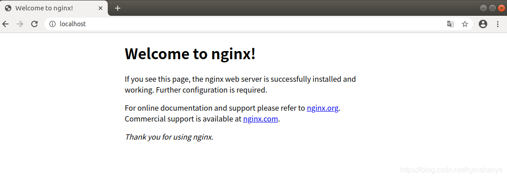
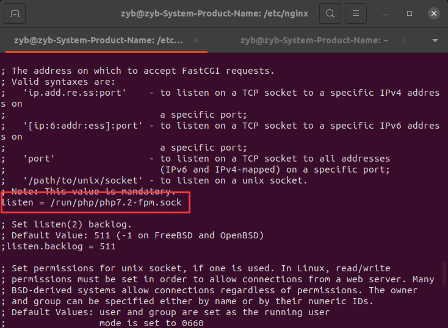
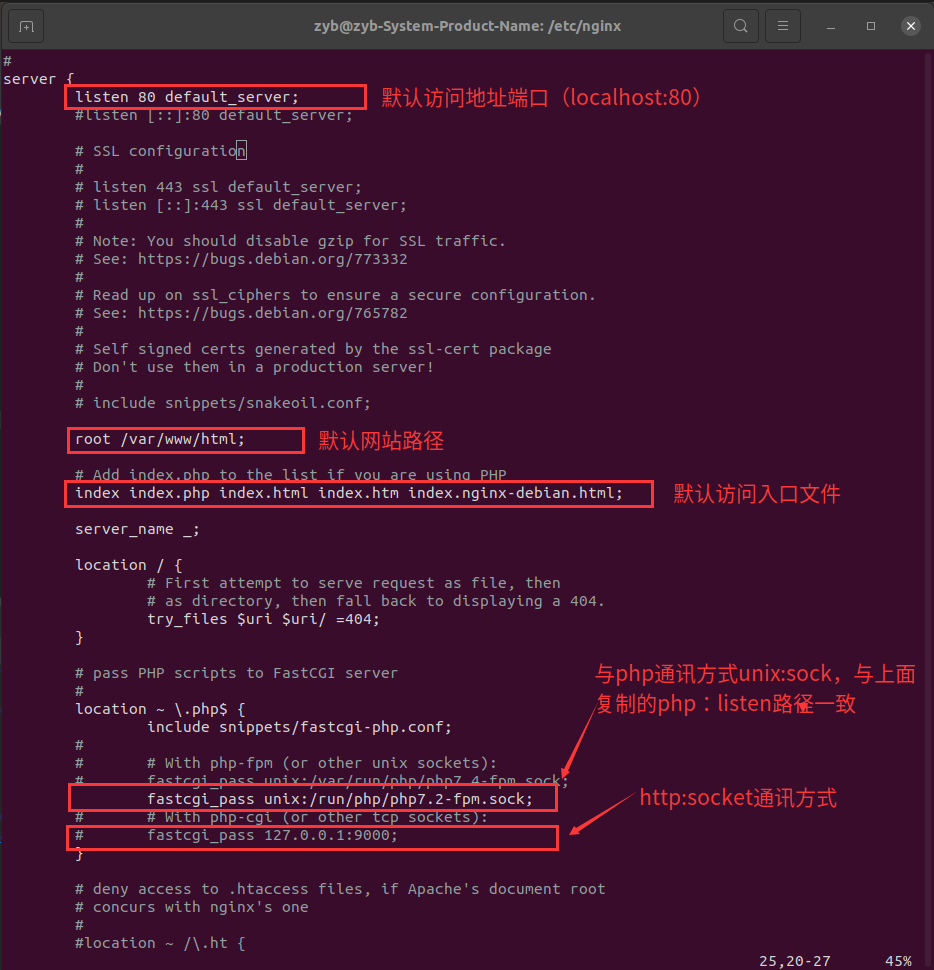
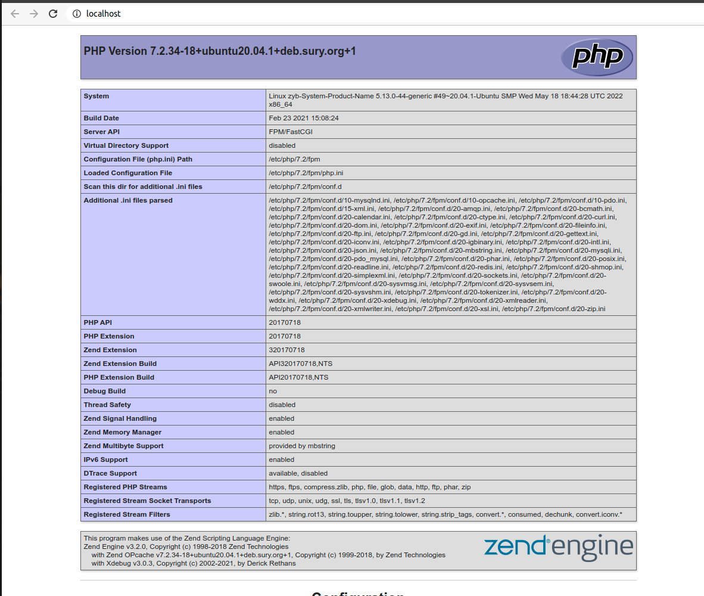
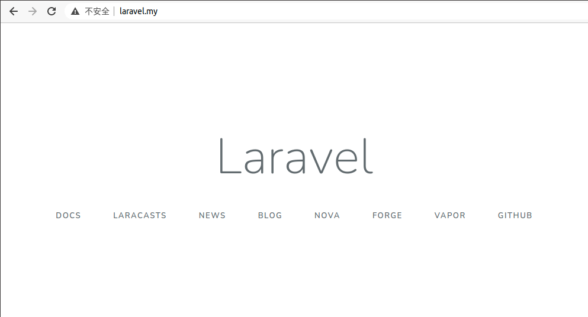

## 一、lnmp
系统环境：Ubuntu20.04 LTS

### 1. 更新ubuntu软件源
```bash
sudo apt-get update
```
### 2. 安装nginx
```bash
sudo apt-get install nginx
```
默认web路径在/var/www/html,在浏览器地址栏输入你的地址，如果出现Welcome to Nginx！，说明安装成功



查看Nginx版本
```
nginx -v
```

目录结构
| 路径                               |       描述        |
| :--------------------------------- | :---------------: |
| /etc/nginx                         | nginx默认安装位置 |
| /etc/nginx/nginx.conf              |   nginx配置文件   |
| /etc/nginx/sites-available/defalut |   网站配置文件    |
| /var/www/html                      |   默认网站目录    |
### 3. 安装mysql
```bash
sudo apt install mysql-server mysql-client
```
安装过程中设置好自己的数据库密码，以备后面登录数据库使用
### 4. 安装php
添加ppa源

直接安装经常容易失败, 通过ppa来安装则简易很多.
```bash
sudo apt-get update
```
安装php7.2、 php7.2-fpm 以及其他常用扩展
```bash
sudo apt-get install php7.2 php7.2-fpm php7.2-mysql php7.2-common php7.2-curl php7.2-cli php7.2-mcrypt php7.2-mbstring php7.2-dom
```
若想安装别的版本, 只需要将 7.2 改成其他版本名就行
### 5. php-fpm与nginx通信
  #### 1. 查看php监听方式
   ```bash
   vim /etc/php/7.2/fpm/pool.d/www.conf
   ```
  

  复制`/run/php/php7.2-fpm.sock`

  #### 2. 默认站点配置
   ```bash
   sudo vim /etc/nginx/sites-available/default
   ```
  

  主要配置三点：
 * `root` 项目地址
 * 添加入口文件 `index.php`
 * 修改 `fastcgi_pass` 地址 ( 需要与 `www.conf` 里 `listen` 的监听地址一致 )
  
  在`/var/www/html`下创建`index.php`
  ```bash
  <?php
	phpinfo();
?>
  ```   

  #### 3. 重启服务
  * 重启php-fpm
    ```bash
    sudo service php7.2-fpm restart
    ```

  * 指定nginx配置文件
    ```bash
    sudo nginx -c /etc/nginx/nginx.conf
    ```

  * 重启nginx
    ```bash
    sudo service nginx restart
    ```
访问：[http://localhost](http://localhost)


### 6. 配置laravel站点
 1. 创建文件夹 `/etc/nginx/conf.d` ，在 `/etc/nginx/conf.d/` 下创建 `laravel.conf` 配置文件
   ```
   server {
        listen        80;
        server_name   www.laravel.my laravel.my;
        root /home/zyb/workspace/laravel/public;

        # 设定本虚拟主机的访问日志
        # Make site accessible from http://localhost/
        error_log /home/zyb/workspace/log/laravel_error.log;

        location / {
            index index.php;
            autoindex  off;
            try_files $uri $uri/ /index.php?$query_string;
        }
        location ~ \.php(.*)$ {
            #fastcgi_pass   127.0.0.1:9000;
            fastcgi_pass unix:/run/php/php7.2-fpm.sock;
            fastcgi_index  index.php;
            fastcgi_split_path_info  ^((?U).+\.php)(/?.+)$;
            fastcgi_param  SCRIPT_FILENAME  $document_root$fastcgi_script_name;
            fastcgi_param  PATH_INFO  $fastcgi_path_info;
            fastcgi_param  PATH_TRANSLATED  $document_root$fastcgi_path_info;
            include        fastcgi_params;
        }


        location ~ /\.ht {
            deny all;
        }
}

   ```
  2. 重启nginx
  ```
  sudo service nginx restart
  ```

   


## 二、 docker